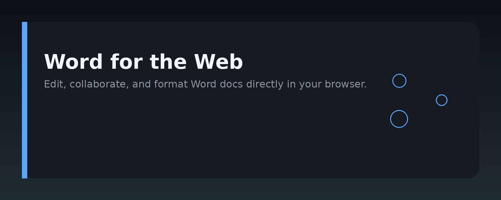
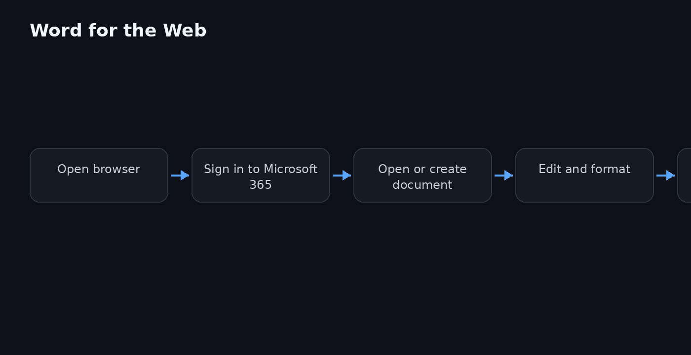

# Word for the Web Editing Guide




## Overview

This repository is a practical handbook for editing documents in Microsoft Word for the Web. It covers the core editing features, formatting workflows, collaboration tools, and common troubleshooting steps for the browser-based version of Word.

Word for the Web is the free, browser-based edition of Microsoft Word. It runs on Windows, macOS, Linux, and ChromeOS without installation. This guide focuses on what you can do in the web version, what you cannot do, and how to work around those gaps.

## Why it exists

Most Word tutorials assume you are using the desktop application. Word for the Web behaves differently: some features are missing, some are renamed, and file handling is tied to OneDrive or SharePoint. New users often get stuck on simple tasks because the interface looks similar but works differently.

This handbook exists to close that gap. It collects the editing workflows that actually work in the browser version, explains the limitations honestly, and gives you copy‑paste‑ready steps for everyday tasks. Whether you are a student, a freelancer, or an office worker switching to the web client, this guide saves you from trial and error.

## Core concepts

**File storage** — Word for the Web opens documents from OneDrive, SharePoint, or a local upload. There is no local file browser; you work through the cloud.

**Autosave** — The web version saves continuously. There is no Save button in the main toolbar. Changes are written to the cloud automatically.

**Editing modes** — You can edit directly in the browser, or open the document in the desktop app for advanced features. The web version shows a banner when desktop-only features are used.

**Collaboration** — Real-time co-authoring is built in. Multiple people can edit the same document simultaneously, with presence indicators and comments.

**Feature parity** — Word for the Web covers about 90% of daily editing needs: text formatting, styles, tables, images, headers, footers, and basic layout. Advanced features like mail merge, macros, and some track-changes options are desktop-only.

## Architecture

The repository is organized as a set of Markdown guides, each covering a specific editing topic.

```
word-web-editing-guide-handbook/
├── assets/
│   ├── banner.png
│   └── architecture.png
├── guides/
│   ├── formatting-text.md
│   ├── tables-and-images.md
│   ├── collaboration.md
│   ├── track-changes.md
│   └── troubleshooting.md
├── examples/
│   └── sample-document-structure.md
├── README.md
└── LICENSE
```

- `guides/` — step-by-step instructions for each editing area.
- `examples/` — sample document structures and formatting templates you can copy.
- `assets/` — images used in the README and guides.
- `LICENSE` — MIT license text.

## Practical workflow

A typical editing session in Word for the Web looks like this:

1. Open your browser and go to the Word for the Web site.
2. Sign in with your Microsoft account.
3. Create a new blank document or open an existing file from OneDrive.
4. Type your content, using the toolbar for formatting.
5. Insert images or tables where needed.
6. Share the document with collaborators using the Share button.
7. Review comments and resolve them.
8. Let autosave handle the rest — no manual saving needed.

For offline work, open the document in the desktop Word app, edit locally, then sync back to the cloud.

## Examples

**Example 1: Apply a heading style**

```markdown
1. Select the text you want to turn into a heading.
2. In the toolbar, click the "Styles" dropdown (shows "Normal" by default).
3. Choose "Heading 1" or "Heading 2".
4. The text updates immediately, and the navigation pane picks it up.
```

**Example 2: Insert a table**

```markdown
1. Place your cursor where the table should go.
2. Click "Insert" in the top menu.
3. Click "Table".
4. Drag to select the number of rows and columns.
5. Release to insert the table.
6. Use the table tools tab to adjust borders and shading.
```

**Example 3: Add a comment**

```markdown
1. Select the text you want to comment on.
2. Click "Comment" in the toolbar (or press Ctrl+Alt+M).
3. Type your comment in the pane on the right.
4. Press Enter to post it.
5. Collaborators see the comment and can reply or resolve it.
```

**Example 4: Export as PDF**

```markdown
1. Click "File" in the top-left corner.
2. Click "Save As" or "Download As".
3. Choose "PDF".
4. The browser downloads the PDF version of your document.
```

## FAQ

**Is Word for the Web free?**  
Yes, you can use it free with a Microsoft account. Some advanced features require a Microsoft 365 subscription.

**Can I work offline?**  
Not directly in the browser. You need the desktop app for offline editing.

**Where are my files saved?**  
They are saved to OneDrive or SharePoint, depending on where you opened them.

**Can multiple people edit at the same time?**  
Yes. Real-time co-authoring is supported.

**Are macros supported?**  
No. Macros and VBA are desktop-only features.

**How do I get the desktop version?**  
Click "Open in Desktop App" in the top toolbar. This requires Word to be installed on your machine.

**Does track changes work in the web version?**  
Yes, basic track changes works. Advanced options like change tracking for specific reviewers are desktop-only.

**What happens if I use a desktop-only feature?**  
You will see a warning banner. The feature will not work until you open the document in the desktop app.

## License

MIT License

Copyright (c) 2024

Permission is hereby granted, free of charge, to any person obtaining a copy of this software and associated documentation files (the "Software"), to deal in the Software without restriction, including without limitation the rights to use, copy, modify, merge, publish, distribute, sublicense, and/or sell copies of the Software, and to permit persons to whom the Software is furnished to do so, subject to the following conditions:

The above copyright notice and this permission notice shall be included in all copies or substantial portions of the Software.

THE SOFTWARE IS PROVIDED "AS IS", WITHOUT WARRANTY OF ANY KIND, EXPRESS OR IMPLIED, INCLUDING BUT NOT LIMITED TO THE WARRANTIES OF MERCHANTABILITY, FITNESS FOR A PARTICULAR PURPOSE AND NONINFRINGEMENT. IN NO EVENT SHALL THE AUTHORS OR COPYRIGHT HOLDERS BE LIABLE FOR ANY CLAIM, DAMAGES OR OTHER LIABILITY, WHETHER IN AN ACTION OF CONTRACT, TORT OR OTHERWISE, ARISING FROM, OUT OF OR IN CONNECTION WITH THE SOFTWARE OR THE USE OR OTHER DEALINGS IN THE SOFTWARE.